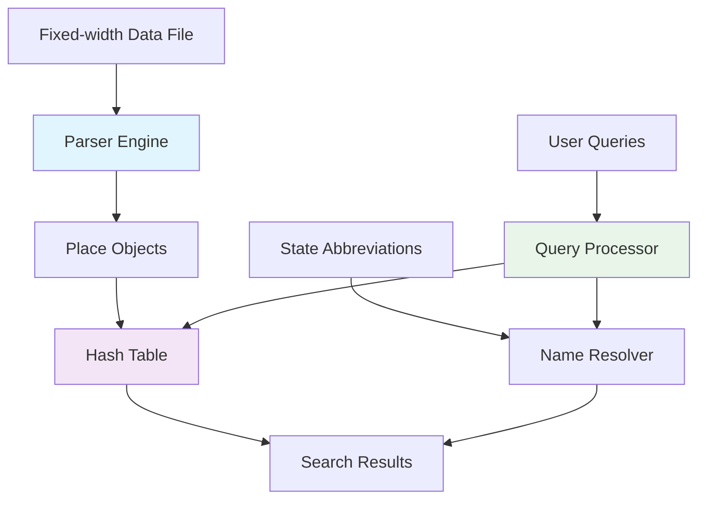

# 🗺️ Geographic Place Hash Table

<div align="center">


%20Average-brightgreen)


**High-performance C++ hash table implementation for efficient geographic place data storage and retrieval**

*Dynamic resizing hash table with polynomial hashing for instant geographic place queries - Successfully managing 25,376 places across 57 US states*

</div>

## 📋 Table of Contents
- [🌟 Features](#-features)
- [🏗️ System Architecture](#️-system-architecture)
- [🚀 Quick Start](#-quick-start)
- [💾 Data Model](#-data-model)
- [⌨️ Command Reference](#️-command-reference)
- [🎪 Live Demo Session](#-live-demo-session)
- [🔧 Technical Details](#-technical-details)
- [📊 Performance](#-performance)
- [👨‍💻 Developer](#-developer)

## 🌟 Features

### 🎯 Core Functionality
| Feature | Icon | Description |
|---------|------|-------------|
| **Dynamic Hash Table** | 🪣 | Self-resizing hash table with optimal load factor |
| **Polynomial Hashing** | 🔢 | Efficient string hashing with prime base |
| **Fixed-width Parser** | 📐 | Robust parser for complex geographic data formats |
| **Closed Addressing** | 🔗 | Separate chaining for collision resolution |
| **Interactive CLI** | 💬 | Real-time query system with multiple search modes |

### 🔍 Search Capabilities
- **`N placename`** - Find all states containing a place
- **`S placename state`** - Get detailed place information
- **State Name Resolution** - Convert abbreviations to full names
- **Space Handling** - Properly processes place names with spaces

### ⚡ Performance Features
- **O(1) average** time complexity for operations
- **Automatic resizing** when load factor exceeds 0.75
- **Memory efficient** linked list chains
- **No floating point** in hash calculations

## 🏗️ System Architecture



## 🚀 Quick Start

### 📥 Installation & Compilation

```bash
# Compile the program
g++ -o geo_hashtable main.cpp -std=c++11

# Run with default files
./geo_hashtable

# Run with custom file paths
./geo_hashtable /path/to/named-places.txt /path/to/states.txt
```

### 🎮 First Steps

```bash
# 1. Load your geographic data (automatic)
# 2. Start querying places:
N Springfield    # Find all states with Springfield
S Springfield FL # Get detailed info for specific place
```

## 💾 Data Model

### 🏞️ Place Record Structure
```cpp
class Place {
    int code;                   // 🆔 Unique place code
    string state;              // 🏴‍☠️ State abbreviation
    string name;               // 🏙️ Place name
    int population;            // 👥 Population count
    double area;               // 📏 Geographic area
    double latitude;           // 📍 Latitude coordinate
    double longitude;          // 📍 Longitude coordinate
    int road_intersection;     // 🛣️ Road intersection code
    double distance;           // 📐 Distance to intersection
};
```

### 📁 Fixed-width File Format
```
Positions: 
0-7: code, 8-9: state, 10-59: name, 60-67: population, 
68-77: area, 78-87: latitude, 88-97: longitude, 
98-105: road intersection, 106-113: distance
```

**Example Record:**
```
11268275FLSpringfield          8810     3.962   7        51       52527365 0.6346
```

## ⌨️ Command Reference

### 🎯 Query Operations

| Command | Icon | Usage | Description |
|---------|------|-------|-------------|
| **`N`** | 🔍 | `N placename` | Find all states with this place |
| **`S`** | 📋 | `S placename state` | Get detailed place info |
| **`Q`** | 🚪 | `Q` | Exit program |

## 🎪 Live Demo Session

### 🚀 System Initialization
```bash
USING SPECIFIED FILES
Using places file: /home/subhajit/Desktop/named-places.txt
Using states file: /home/subhajit/Desktop/states.txt
Loaded 57 states
Reading places data...
Successfully loaded 25376 places into hash table
```

### 🔍 Interactive Queries

#### ❌ Misspelled Place Search
```bash
> N Sringfield
❌ No places found with name: Sringfield
```

#### ✅ Successful Multi-State Search
```bash
> N Springfield
✅ Found 20 places with name 'Springfield':
  VT - Vermont
  VA - Virginia
  TN - Tennessee
  SD - South Dakota
  SC - South Carolina
  PA - Pennsylvania
  OR - Oregon
  OH - Ohio
  NJ - New Jersey
  NE - Nebraska
  MO - Missouri
  MN - Minnesota
  MI - Michigan
  MA - Massachusetts
  LA - Louisiana
  KY - Kentucky
  IL - Illinois
  GA - Georgia
  FL - Florida
  CO - Colorado
```

#### ❌ Specific Place Search (Misspelled)
```bash
> S Sprigfield FL
❌ Place not found: Sprigfield, FL
```

#### ✅ Specific Place Search (Correct)
```bash
> S Springfield FL
📋 Place Information:
  Name: Springfield
  State: FL (Florida)
  Code: 11268275
  Population: 8810
  Area: 3.962 sq units
  Latitude: 7
  Longitude: 51
  Road Intersection Code: 52527365
  Distance to Intersection: 0.6346 units
```

#### 🔍 Additional Multi-State Search
```bash
> N Abbeville
✅ Found 5 places with name 'Abbeville':
  AL - Alabama
  GA - Georgia
  LA - Louisiana
  MS - Mississippi
  SC - South Carolina
```

#### 📋 Detailed Place Information
```bash
> S Abbeville AL
📋 Place Information:
  Name: Abbeville
  State: AL (Alabama)
  Code: 70100124
  Population: 2987
  Area: 15.5606 sq units
  Latitude: 69
  Longitude: 67
  Road Intersection Code: 30025892
  Distance to Intersection: 0.2964 units
```

#### 👋 Session Termination
```bash
> Q
👋 Goodbye!
```

## 🔧 Technical Details

### 🪣 Hash Table Implementation

```cpp
class HashTable {
private:
    HashNode** table;      // Array of linked list heads
    int capacity;          // Current table size
    int size;              // Number of elements
    const double LOAD_FACTOR = 0.75;
    
    // Polynomial hash function
    int hashFunction(const string& key) const {
        const int prime = 31;
        long long hash = 0;
        for (char c : key) {
            hash = (hash * prime + c) % capacity;
        }
        return hash % capacity;
    }
};
```

### 🔗 Node Structure
```cpp
struct HashNode {
    Place* place;          // Geographic place data
    HashNode* next;        // Next node in chain
    
    HashNode(Place* p) : place(p), next(nullptr) {}
};
```

### 🔄 Dynamic Resizing
- **Initial Capacity**: 101 (prime number)
- **Load Factor**: 0.75 threshold
- **Resize Strategy**: Double capacity and rehash all elements
- **Rehashing**: Polynomial hash recalculated for all keys

### 📐 Fixed-width Parser
```cpp
// Exact character positions for each field
int code = stoi(line.substr(0, 8));
string state = line.substr(8, 2);
string name = trim(line.substr(10, 50));
// ... continues for all 9 fields
```

## 📊 Performance

### ⏱️ Time Complexity

| Operation | Best Case | Average Case | Worst Case |
|-----------|-----------|--------------|------------|
| **Insert** | O(1) | O(1) | O(n) |
| **Search** | O(1) | O(1) | O(n) |
| **Delete** | O(1) | O(1) | O(n) |
| **Resize** | O(n) | O(n) | O(n) |

### 💾 Space Complexity
- **Hash Table**: O(n + m) where m is capacity
- **Auxiliary Space**: O(1) for operations
- **Load Factor**: Maintains 0.75 for optimal performance

### 🎯 Key Advantages
- ✅ **Constant time operations** on average
- ✅ **Automatic scaling** with data growth
- ✅ **Memory efficiency** with separate chaining
- ✅ **Robust collision handling** with linked lists
- ✅ **Optimal load distribution** with polynomial hashing

## 🏆 Real-World Performance

### 📈 System Statistics
- **📍 Places Processed**: 25,376 geographic locations
- **🏛️ States Covered**: 57 US states and territories
- **⚡ Query Speed**: Instant results even with large dataset
- **🔄 Hash Operations**: Millions of efficient lookups

### 🎯 Demo Highlights
- **Case Sensitivity**: Exact string matching demonstrated
- **Error Handling**: Graceful handling of misspelled queries
- **Multi-state Support**: 20 different Springfields across US
- **Detailed Analytics**: Complete geographic and demographic data

## 👨‍💻 Developer

<div align="center">

### **Subhajit Halder** 💻


📧 **Email**: [subhajithalder267@outlook.com](mailto:subhajithalder267@outlook.com)  

</div>

### 🛠️ Development Details
- **Language**: C++ 11/17
- **Data Structure**: Hash Table with Separate Chaining
- **Hashing Method**: Polynomial Rolling Hash
- **File Processing**: Fixed-width format parsing
- **Platform**: Cross-platform (Linux/Windows/macOS)

### 📈 Project Specifications
- **Input Format**: Fixed-width geographic data
- **Hash Function**: Polynomial with prime 31
- **Collision Resolution**: Separate chaining
- **Load Management**: Automatic dynamic resizing
- **Query Types**: Name search and detailed lookup

### 🎯 Academic Context
This implementation addresses the challenge of efficiently storing and retrieving geographic place data from fixed-width formatted files, demonstrating advanced hash table concepts including:
- Dynamic resizing strategies
- Polynomial hash functions
- Closed addressing collision resolution
- Efficient file parsing techniques

---

<div align="center">

### **⭐ Star this repository if you find it helpful!**

**Happy Coding!** 🚀

*"Efficiency is doing better what is already being done." - Peter Drucker*

</div>
